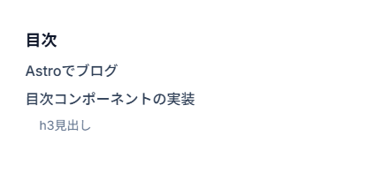

## Astroでブログ

メインブログはAstro → Nuxtっていう変遷を辿っています。
Nuxtを採用している理由は多々あるのですが、モジュール系が多いので使っています。

しかし速度などの面で見ればAstroに軍配が上がります。速いです。軽いし。

AIで作った画像をカバー画像にするのはこの記事だけですよ。

## 目次コンポーネントの実装

```astro title="components/TableofContent.astro"
---
import type { MarkdownHeading } from "astro";

interface Props {
  headings: MarkdownHeading[];
}

const { headings } = Astro.props;

const filteredHeadings = headings.filter(
  (heading) => heading.depth >= 2 && heading.depth <= 3,
);
---

<nav class="p-4">
  <h2 class="text-lg font-bold">目次</h2>
  <ul class="space-y-2">
    {
      filteredHeadings.map((h) => (
        <li class={h.depth === 3 ? "ml-4 text-sm" : "text-base font-medium"}>
          <a
            href={`#${h.slug}`}
            class:list={[
              "transition-all duration-150 hover:text-slate-700",
              h.depth === 2 ? "text-slate-700" : "text-slate-500",
            ]}
          >
            {h.text}
          </a>
        </li>
      ))
    }
  </ul>
</nav>
```

h2,h3見出しを表示します。

### h3見出し

h3見出しは少しだけ内側に薄く表示されます。



素晴らしいですね！

## 投稿カード

記事を表示するためのカードです。

```astro title="components/BlogPost.astro"
---
import type { CollectionEntry } from "astro:content";
import { Image } from "astro:assets";

interface Props {
  post: CollectionEntry<"blog">;
}

const { post } = Astro.props;
---

<a
  href={`/blog/${post.id}`}
  class="flex flex-col overflow-hidden rounded-md border border-slate-200"
>
  {
    post.data.cover && (
      <Image
        src={post.data.cover}
        alt={`${post.data.title}のカバー画像`}
        class="aspect-video object-cover"
      />
    )
  }
  <div class="flex flex-col p-4">
    <p class="text-sm text-slate-500">
      {
        post.data.date.toLocaleDateString("ja-jp", {
          year: "numeric",
          month: "2-digit",
          day: "2-digit",
        })
      }
    </p>
    <h3 class="text-lg font-bold">{post.data.title}</h3>
    <p class="text-base text-slate-700">{post.data.description}</p>
  </div>
</a>
```

特に面白みもない実装ですが、こんなものでしょう。